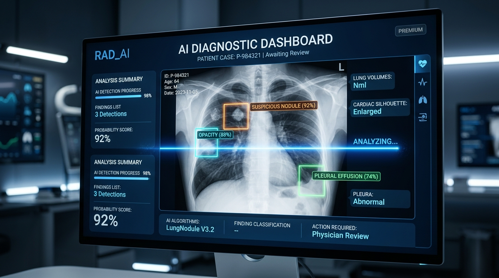
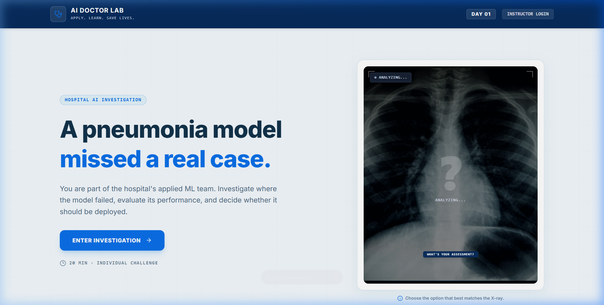
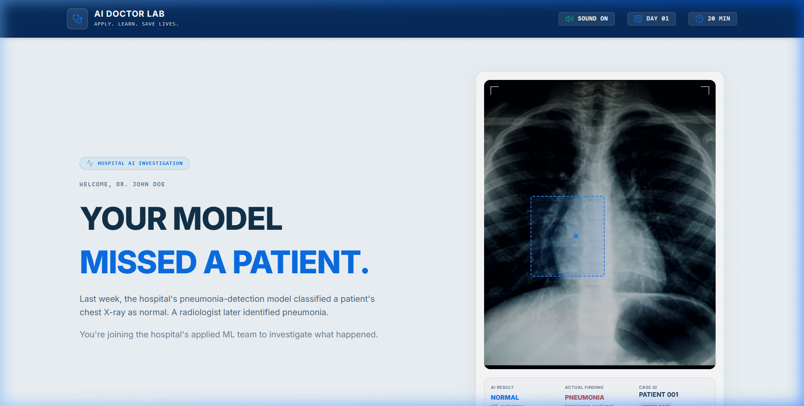
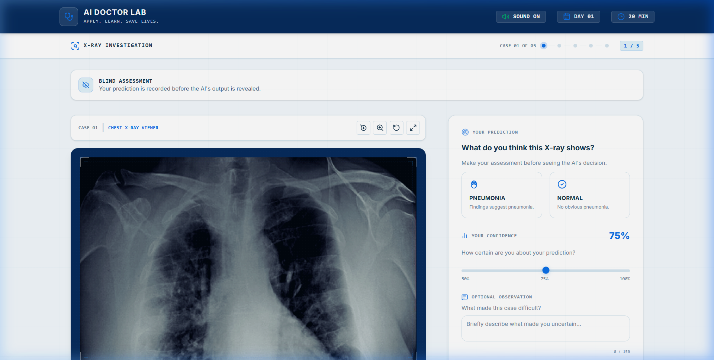

# AI Doctor Lab &middot; Clinical AI Educational Dashboard



**AI Doctor Lab** is a high-fidelity clinical AI simulation dashboard designed for medical students and practitioners to explore the strengths, limitations, and operational mechanics of diagnostic AI models. Through interactive challenges, students learn first-hand how adjustment of model classification thresholds affects critical metrics (Sensitivity, Specificity, False Positives, and False Negatives).

---

## 🚀 Key Features

### 1. Loop-based AI Scanner Animation
- **Interactive Scanning**: Features a horizontal laser scanner scanning chest X-ray images, displaying real-time AI status updates (`ANALYZING...` &rarr; `SCANNING...` &rarr; `AI ANALYSIS READY`).
- **Translucent Overlays**: Diagnostic suggestion cards (`PNEUMONIA` & `NOT PNEUMONIA`) slide directly onto the bottom of the X-ray viewer in a spring-animated container once the scan completes.

### 2. Phase 1: Blind X-Ray Challenge
- **Diagnostic Tasks**: Students inspect 5 clinical chest X-rays to make a blind diagnosis.
- **Audio Feedback**: Instant audio playback upon submitting case responses (positive success sound for matching ground truth; alert warning for incorrect assessments).
- **Control Options**: Includes a global **SOUND ON / MUTED** option in the header.
- **Smooth Page Auto-Scroll**: Pages automatically scroll smoothly back to the top when advancing to the next case or screen, keeping the next X-ray immediately visible.

### 3. Phase 2: Threshold & ROC Curve Explorer
- **Interactive Threshold Adjustments**: Slider controls allow adjustment of the decision boundary between `0.00` and `1.00`.
- **Real-Time Visualizations**: Dynamic updates of Confusion Matrices, ROC curves, and performance stats showing the shift between false positives and critical false negatives.

### 4. Phase 3: Real-Time Classroom Control
- **Supabase Real-Time Integration**: Integrated RLS configurations to allow instructors to orchestrate classroom quiz sequences and live student progress tracking.

---

## 📸 Interface Walkthrough

### Landing Page & Automated Diagnostics
The clinical entry screen features the interactive AI lung-scanner animation loop:


### Investigation Briefing
Students are presented with the case summary, background objectives, and instructions before inspecting active scans:


### Phase 1: Blind Inspection Sandbox
Inspecting high-resolution X-rays, making predictions, and receiving instant audio-visual diagnostic feedback:


---

## 🛠️ Tech Stack & Setup

- **Core Framework**: React (Vite, TypeScript)
- **Animation Engine**: Framer Motion & CSS Keyframes
- **Styles**: Tailwind CSS v4 (with `@theme` keyframes)
- **Database / Sync**: Supabase (Real-Time client and RLS permissions)

### Getting Started

1. Clone the repository and install dependencies:
   ```bash
   npm install
   ```

2. Configure environment variables in `.env.local`:
   ```env
   VITE_SUPABASE_URL=your_supabase_url
   VITE_SUPABASE_ANON_KEY=your_supabase_anon_key
   ```

3. Launch the development server:
   ```bash
   npm run dev
   ```

4. Compile production distribution:
   ```bash
   npm run build
   ```
